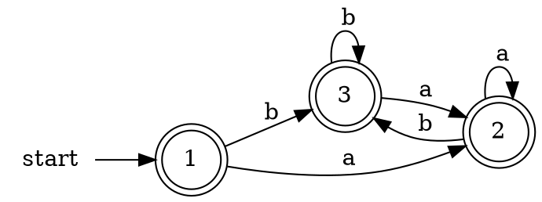
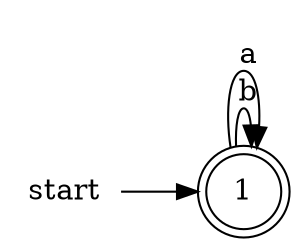

# regex
Experimental implementation of regex;
construct NFA/DFA from regex.

### Example
Construct NFA/DFA for the regex `(a|b)*`
```python
import regex

a = regex.NFA.char('a') # construct NFA of regex 'a'
b = regex.NFA.char('b') # construct NFA of regex 'b'
union = a.union(b) # construct NFA of regex 'a|b'
closure = union.closure() # construct NFA of regex '(a|b)*' (kleene closure)

print(closure.to_graphviz()) 
```

**Output**:

**NFA**:


```python
dfa = regex.subset_construction(nfa)
print(dfa.to_graphviz())
```
**Output**:




**DFA**:


```python
min_dfa = regex.dfa_minimize(dfa)
print(min_dfa.to_graphviz())
```

**Output**:


**Minimal DFA**:


Utility function is provided to simplify the construction of NFA, escape ('\') and extensions ('[]^?') not supported, use carefully:
```python
# Build NFA from regex
nfa = regex.parse('(a|b)*')
```
